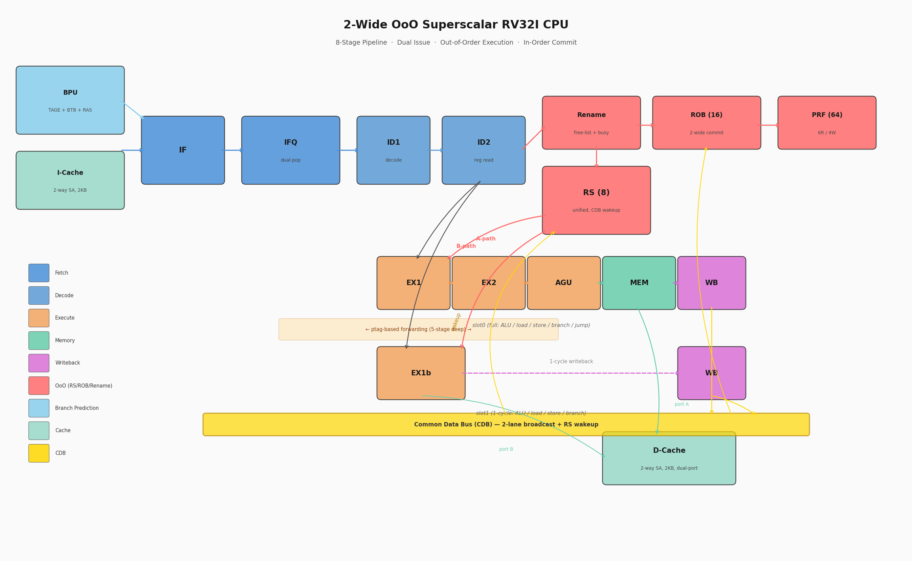

# CPU Architecture 102

## 2-Wide Out-of-Order Superscalar RISC-V (RV32I) CPU

A fully functional dual-issue, out-of-order execution RISC-V CPU built in
Verilog, developed incrementally for teaching and learning purposes.
4,754 lines of synthesizable RTL across 18 modules.

---

## Architecture Overview



| Feature | Implementation |
|---------|---------------|
| ISA | RV32I (40 instructions) |
| Pipeline | 8-stage: IF → ID1 → ID2 → EX1 → EX2 → AGU → MEM → WB |
| Issue Width | 2-wide superscalar (slot0 full-function + slot1 ALU/load/store/branch) |
| Execution | Out-of-order issue & execute, in-order commit |
| Reservation Station | 8-entry unified, age-based oldest-first selection, 2 issue paths |
| Reorder Buffer | 16-entry, 2-wide alloc / 2-wide writeback / 2-wide commit |
| Physical Register File | 64-entry, 6 read ports / 4 write ports |
| Register Renaming | Full rename with free-list + busy vector |
| Common Data Bus | 2-lane CDB for broadcast + RS wakeup |
| Branch Prediction | TAGE-2L direction + 2-way BTB + Return Address Stack |
| I-Cache | 2-way set-associative, 64 sets × 4 words/line = 2 KB |
| D-Cache | 2-way set-associative, 64 sets × 4 words/line = 2 KB, dual-port (A+B) |
| Forwarding | ptag-based, 5-stage deep per slot |

### Pipeline Diagram

```
                   ┌─ slot0: EX1 → EX2 → AGU → MEM → WB   (ALU / load / store / branch / jump)
IF → ID1 → ID2 ──┤
                   └─ slot1: EX1b → WB                      (ALU / load / store / branch, 1-cycle)

                   ┌─ A-path → slot0 EX1   (OoO issue to main pipe)
         RS(8) ───┤
                   └─ B-path → slot1 EX1b  (OoO issue to aux pipe)
```

### Out-of-Order Execution Flow

```
Dispatch ──→ RS    (wait for operands via CDB wakeup)
         ──→ ROB   (allocate tag, track program-order commit)
         ──→ Rename (allocate physical register, mark busy)

Issue    ──→ RS picks oldest-ready entry
         ──→ A-path: non-load → slot0 EX1 (5-stage)
         ──→ B-path: ALU/load/store/branch → slot1 EX1b (1-cycle)

Writeback ──→ CDB broadcast (ptag + value)
          ──→ RS wakeup dependents
          ──→ ROB mark done

Commit   ──→ ROB retires head in program order (up to 2/cycle)
         ──→ Rename frees old ptag
```

---

## Performance

All numbers measured with zero-latency D-cache model.
**CPI_c** = cycles ÷ committed instructions (standard IPC metric).
**dual%** = fraction of issue cycles dispatching 2 instructions.

### Benchmark Results

| Benchmark | Cycles | Committed | CPI_c | IPC | dual% | br_miss% | D$_miss% |
|-----------|-------:|----------:|------:|----:|------:|---------:|---------:|
| fib_20 | 96 | 148 | 0.649 | 1.54 | 50.0 | 4.2 | 0.0 |
| sum_1_to_100 | 319 | 410 | 0.778 | 1.29 | 33.8 | 1.9 | 0.0 |
| bsearch_64 | 754 | 964 | 0.782 | 1.28 | 42.7 | 4.0 | 15.5 |
| popcount_64 | 979 | 1,159 | 0.845 | 1.18 | 66.4 | 0.3 | 0.0 |
| crc32_64b | 2,070 | 2,575 | 0.804 | 1.24 | 62.3 | 10.9 | 25.0 |
| bsort_16 | 1,401 | 1,677 | 0.835 | 1.20 | 40.6 | 1.0 | 0.6 |
| memcpy_64w | 401 | 397 | 1.010 | 0.99 | 72.9 | 2.9 | 24.6 |
| dotprod_32 | 8,627 | 7,762 | 1.111 | 0.90 | 45.4 | 19.3 | 16.0 |
| matmul_4x4 | 17,809 | 16,139 | 1.103 | 0.91 | 44.3 | 18.9 | 6.3 |

**Highlights:**
- **6 of 9 benchmarks achieve CPI < 1.0** (IPC > 1.0) — the CPU retires
  more than one instruction per cycle on average.
- Peak throughput: `fib_20` at **1.54 IPC**.
- `memcpy_64w` reaches **73% dual-issue rate**, near the theoretical limit
  for sequential LW/SW pairs.
- `dotprod` / `matmul` are bottlenecked by branch mispredictions (19%)
  from software-multiply subroutine calls, not by the execution engine.

### Dual-Issue Pair-Block Analysis

When slot1 cannot pair, the causes (% of single-issue cycles):

| Benchmark | dual% | RAW | nta | xww | lu | nv1 |
|-----------|------:|----:|----:|----:|---:|----:|
| fib_20 | 50.0 | 4.5 | 4.5 | 88.6 | 0.0 | 2.3 |
| sum_1_to_100 | 33.8 | 1.5 | 50.0 | 48.0 | 0.0 | 0.5 |
| bsearch_64 | 42.7 | 49.3 | 18.7 | 19.0 | 11.3 | 1.7 |
| popcount_64 | 66.4 | 74.4 | 25.2 | 0.0 | 0.0 | 0.4 |
| crc32_64b | 62.3 | 25.2 | 31.3 | 18.6 | 0.0 | 24.9 |
| bsort_16 | 40.6 | 39.7 | 5.2 | 2.3 | 18.4 | 0.2 |
| memcpy_64w | 72.9 | 90.3 | 4.2 | 1.4 | 0.0 | 2.8 |
| dotprod_32 | 45.4 | 32.7 | 32.2 | 16.7 | 1.0 | 16.3 |
| matmul_4x4 | 44.3 | 34.2 | 33.1 | 17.4 | 0.0 | 15.3 |

| Abbrev | Meaning |
|--------|---------|
| **RAW** | Same-cycle data dependency between slot0 and slot1 (fundamental) |
| **nta** | Slot1 instruction type not pairable (JAL/JALR) |
| **xww** | Cross-cycle WAW: slot1 rd conflicts with in-flight slot0 |
| **lu** | Load-use hazard blocking slot1 |
| **nv1** | No valid instruction available in slot1 position |

### Correctness Verification

| Test Suite | Count | Result |
|------------|------:|--------|
| Robustness (wrong-path store) | 1 | PASS |
| Benchmarks | 9 | 9/9 PASS |
| Micro hazard tests | 6 | 6/6 PASS |
| Micro pair/split tests | 4 | 4/4 PASS |
| Random generated RV32I | 500 | 500/500 PASS |

---

## RTL Modules

| Module | Lines | Description |
|--------|------:|-------------|
| `cpu_top.v` | 1,967 | Top-level pipeline, dual-issue arbitration, OoO control |
| `rs_shadow.v` | 477 | Reservation Station (8-entry unified, CDB wakeup) |
| `bpu.v` | 394 | Branch Prediction Unit (TAGE + GHR + BTB) |
| `rob.v` | 333 | Reorder Buffer (16-entry, 2-wide alloc/wb/commit) |
| `bpu_tage_eval.v` | 274 | TAGE shadow evaluator for BPU training |
| `dmem.v` | 220 | Data Cache (2-way SA, dual-port A+B, write-through) |
| `rename.v` | 189 | Register rename (free-list + busy vector) |
| `ifq.v` | 186 | Instruction Fetch Queue (dual-pop for 2-wide dispatch) |
| `control.v` | 165 | Instruction decode / control signal generation |
| `ras_shadow.v` | 126 | Return Address Stack (IF-stage JALR-ret predictor) |
| `imem.v` | 98 | Instruction Cache (2-way SA) |
| `prf.v` | 83 | Physical Register File (64-entry, 6R/4W, write bypass) |
| `defines.v` | 70 | Global constants, opcodes, pipeline parameters |
| `forwarding.v` | 58 | ptag-based forwarding network |
| `hazard.v` | 36 | Load-use hazard detection |
| `alu.v` | 30 | 32-bit ALU (shared by both execution slots) |
| `branch_unit.v` | 25 | Branch comparison logic |
| `imm_gen.v` | 23 | Immediate value generator |
| **Total** | **4,754** | |

---

## Getting Started

### Prerequisites

- [Icarus Verilog](http://iverilog.icarus.com/) (`iverilog`, `vvp`)
- [GTKWave](http://gtkwave.sourceforge.net/) (waveform viewer, optional)
- Python 3 (for test generation and benchmarks)

```bash
# macOS
brew install icarus-verilog gtkwave

# Ubuntu / Debian
sudo apt install iverilog gtkwave
```

### Build and Run

```bash
make                  # compile
make run              # run default test (test01)
make wave             # open waveform in GTKWave
make robust           # wrong-path store regression
make clean            # clean build artifacts
```

### Run a Specific Program

```bash
make run PROG=tb/programs/bench/fib_20.hex
make run PROG=tb/programs/generated/rv32_rand_042.hex
```

---

## Test Infrastructure

### Random Regression (500 RV32I tests)

```bash
# Generate 500 random tests
python3 tools/gen_rv32_tests.py --count 500 --out-dir tb/programs/generated

# Run all
python3 tools/run_generated_tests.py --dir tb/programs/generated -j 1
```

Pass criteria: `x31 = 0xCAFEBABE` detected, no timeout, register state
matches the built-in ISA simulator.

### Performance Benchmarks

```bash
# Generate and run all 9 benchmarks
python3 tools/run_benchmarks.py --regen

# Run a single kernel with extended timeout
make run PROG=tb/programs/bench/matmul_4x4.hex TIMEOUT_NS=8000000

# Filter benchmarks by name
python3 tools/run_benchmarks.py --filter "matmul_*"
```

### Available Benchmarks

| Kernel | Description | Primary Stress |
|--------|-------------|----------------|
| `fib_20` | Iterative Fibonacci(20) | Short RAW chain, EX→EX forwarding |
| `sum_1_to_100` | Sum 1..100 | Predictable backward branch |
| `memcpy_64w` | Copy 64 words | LW/SW pairs, D-Cache bandwidth |
| `popcount_64` | Popcount over 1..64 | Nested loop, data-dependent termination |
| `bsort_16` | Bubble sort 16 ints | Adjacent LW/SW + data-dependent branches |
| `crc32_64b` | CRC32 over 64 bytes | Bit-level loop, hard-to-predict branches |
| `bsearch_64` | Binary search in 64-element array | Data-dependent branches |
| `dotprod_32` | Dot product (len 32, SW multiply) | Function call pattern (JAL/JALR) |
| `matmul_4x4` | 4×4 integer matmul (SW multiply) | Triple loop + strided memory access |

### Adding a New Benchmark

Edit `tools/gen_benchmarks.py`:
1. Write the kernel using the `Asm` helper (`tools/asm.py`) with label support.
2. End with `append_epilogue(a)` for the testbench PASS detector.
3. Add to the `BENCHMARKS` dict.
4. Run `python3 tools/run_benchmarks.py --regen`.

---

## Directory Layout

```
rtl/
  core/       Pipeline and OoO control RTL (cpu_top, RS, ROB, rename, BPU, PRF, ...)
  mem/        Cache modules (I-Cache, D-Cache)
tb/
  tb_cpu.v    Testbench with observability counters
  programs/
    bench/        Performance benchmark hex files
    generated/    Random regression hex files
    micro_hazard/ Targeted hazard test cases
    micro_slot1/  Slot1 pairing test cases
sim/            Simulation artifacts (gitignored)
docs/           Architecture planning documents
tools/
  asm.py                Label-based RV32I assembler
  gen_benchmarks.py     Benchmark hex generator
  gen_rv32_tests.py     Random test generator + ISA simulator
  run_benchmarks.py     Benchmark runner with CPI/branch/cache reporting
  run_generated_tests.py  Batch regression runner
```

## Design Conventions

- Rising-edge clocking, synchronous active-low reset (`rst_n`).
- Pipeline registers: `<src>_<dst>_<signal>`, e.g. `id_ex_pc`, `ex_mem_alu_y`.
- Reset PC = `0x0000_0000` (configurable in `defines.v`).
- Commit messages in English.
