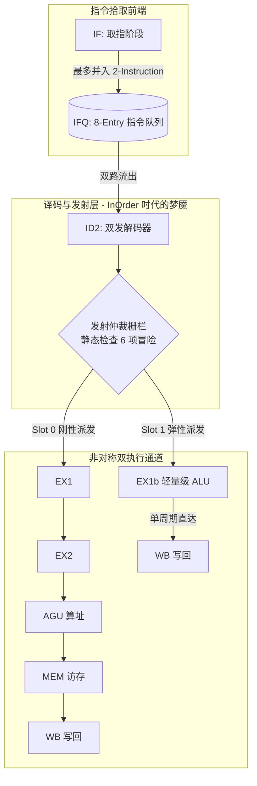

# 从零开始造一颗 RISC-V CPU（二）：顺序双发射（In-Order Dual-Issue）基线架构与冒险黑洞

> 系列博客第 2 篇 —— 这是一个非常有意思的工程伏笔：为什么我们最终走向了“乱序执行（OoO）”？本文将解剖我们的基线版本（main 分支）—— 顺序双发射（In-Order Dual-Issue）架构。我们将看看在这套初代架构中，为了保证两条指令同时无碰撞地在深浅管线中平行飞奔，前端译码器（ID）必须设置多少道保守而沉重的“安检门”（Hazard Checks），并分析它们是如何将 IPC 锁死在天花板下的。

---

## 1. 突破标量极限：超标量与非对称流水线

在一个传统的单发射（Single-Issue）标量 CPU 中，即使流水线没有停顿，它的终极 IPC（Instruction Per Cycle）也被物理焊死在 1.0 的天花板上。为了打破这堵墙，我们在最初的基线架构中引入了**超标量（Superscalar）顺序双发射**设计。

出于对 FPGA 面积和布线连通性的考量，我们没有做绝对的对称管线，而是设计了一条**非对称双发射流水线**：



- **Slot 0（主干道）**：全功能重型流水线，深达 5 级执行段，能够抗住最重的 Load/Store/Branch/ALU 以及长计算指令。
- **Slot 1（辅通道）**：极轻量的 1 周期微管线，专职吸收纯 ALU 计算，起到“拾遗补漏”、榨取指令级并行度（ILP）的作用。

---

## 2. 顺序架构下的“封锁线”：六大静态冒险栅栏 (Hazard Checking)

因为在这个基线版本中，**指令必须按顺序（In-Order）派发、执行并写入物理寄存器**，我们没有任何能够缓存“半成品”的保留站（RS）或推迟写入的重排序缓冲（ROB）。

能否把两条指令平行抛入 Slot 0 和 Slot 1，完全依赖于在 ID2 阶段用纯组合逻辑进行瞬间安检。我们布设了 6 重严密的阻塞逻辑，只要触发任意一项，Slot 1 的指令就会被拦停（Stall）：

```verilog
assign id2_issue_slot1 = id1_id2_valid1          // 1. IFQ 里是否管载了第二发指令
    && id1_is_pairable                           // 2. 指令类型兼容性 (仅轻量指令可放行)
    && id_slot0_safe_for_pair                    // 3. Slot 0 主令的安全余量
    && id1_no_raw_hazard                         // 4. 禁止静态 RAW 真数据依赖
    && id1_no_waw_hazard                         // 5. 禁止同周期 WAW 写冲突
    && id1_no_load_use_hazard                    // 6. 禁止深管线 Load-Use 惩罚
    && id1_no_xcycle_waw;                        // 7. 防微杜渐：跨周期 WAW 踩踏
```

### 2.1 铁壁：RAW (读后写) 真依赖阻塞
在顺序架构里，如果后一条指令依赖前一条指令（如 `a = 1; b = a + 2`）。如果 Slot 0 在算 `a`，Slot 1 绝不能在**同一个时钟周期**去读取 `a`，否则读到的绝对是脏数据。因为缺少动态调度，ID 级一旦发现，只能直接拦住 Slot 1，浪费那一拍。

```verilog
// RAW 仲裁栅栏：Slot 1 绝对禁止读取 Slot 0 当前正在写入的目标寄存器
wire id1_no_raw_hazard = ~(
    id_reg_write && (id_rd != 5'd0) && (
        (slot1_rs1_used && id1_rs1 == id_rd) || // S1 要读的 rs1 撞了 S0 的 rd
        (slot1_rs2_used && id1_rs2 == id_rd)    // S1 要读的 rs2 撞了 S0 的 rd
    )
);
```

### 2.2 畸形的深水区：跨周期 WAW (写后写)
更折磨人的是，因为我们的管线是深浅不一的（Slot 0 有 5 级，Slot 1 只有 1 级）。
如果 Slot 0 派发了一条需要 5 个周期才写回的 `LW x1, (x2)`，而下一个周期的 Slot 1 又派发了一条只要 1 个周期就写回的 `ADD x1, x3, x4`…… **后执行的指令反而提前把结果写回了寄存器，等前者回来时会把最新值强行覆盖导致破坏（WAW 回滚错误）！**

在没有 Register Renaming 消除名字依赖的年代，我们只能写出极其痛苦的**5级纵深跨拍探针 (Cross-Cycle WAW)**进行静态干预：如果前面管线的阴影里还在飞行企图写 `x1` 的指令，后方的指令全部被死死阻塞在前端！

---

## 3. 非对称引擎的前递网络 (Bypass Network)

对于非对称的双发架构，为了减轻 RAW 造成的致命 Stall，旁路网络必须变得异乎寻常的复杂。
Slot 1 的前递来源不仅包含在上一拍刚刚算完的 EX1，还必须生连硬拽地跨接主流水线上的 EX2, AGU, MEM，甚至 WB 边缘。

```verilog
// 恐怖的多级前递引脚，为 Slot 1 供血
wire [31:0] slot1_rs1_fwd =
    match_s0_rd            ? ex_alu_y :         // Slot0 在上一级算完的血热数据
    match(ex_mem_rd_ptag)  ? ex_mem_alu_y :     // EX2 级算完的数据
    match(ex2_agu_rd_ptag) ? ex2_agu_alu_y :    // AGU 级截停
    match(agu_mem_rd_ptag) ? agu_mem_fwd_data : // MEM 阶段数据提取
    match(mem_wb_rd_ptag)  ? wb_data :          // WB 回写的边缘
                             slot1_rs1_base;    // 没有命中活跃指令数据，规矩地读 PRF
```

---

## 4. 走向乱序（OoO）的导火索：双发射阻力实测

这就是全部了吗？理论很完美，但当程序跑起来时满屏幕都是血淋淋的教训。我们在基线 `main` 分支进行了基于归因截点的 Testbench 监控，得出了一组令人深思的数据：

| 汇编应用形态 | In-Order 双发率 (Dual%) | 最致命的阻塞原因 (Stall Root Cause) | 工程深层分析 |
|-------------|------------------|----------------|-----------|
| **memcpy_64w** (数组拷贝)| **73%** | **RAW 绝对真依赖 (90%)** | 后一条 `SW *(A) = reg` 必须死死等待前一条 `LW` 传出 `reg`。在顺序管线下，这种数据流阻塞无法化解。 |
| **fib_20** (状态复用迭代)| **50% 跌落** | **xWAW 跨拍冲突 (89%)** | 斐波那契 `a=b; b=a+b;`，所有变量都绑死在 3 个物理寄存器上。由于**名字冲突**，管线天天触发跨拍 WAW 安检，强行退化成了极度残废的单发射。 |

**为什么我们在后续分支全面转向乱序执行（Out-of-Order）？**

在静态的 In-Order 架构下，一旦编译器或指令集吐出了大量在微观上高度数据耦合或寄存器重名的片段（例如 `fib_20`），流水线在 ID 级就会遭遇大量的 RAW 等待和 WAW 限流。由于它是**“顺序解析并阻塞”**的，一颗有毒的指令卡住了，后续所有即使是无关的数据也动弹不得！

我们通过实验证明：**物理拓扑带来的极限不是瓶颈，寄存器名字假依赖和静态死等才是。**
为了把双发射这条“八车道高速公路”完全榨干跑满，微架构必须剥离掉这种僵硬的拦截！

在理解了顺序双发射极度痛苦的并发屏障后，在系列第 5 篇中，你将看到我们在 `feature/ooo` 分支引入了具有跨时代意义的 **寄存器重命名（Register Renaming）和保留站（RS/Tomasulo）**。届时，xWAW 将在硬件换名下土崩瓦解，那些在静态被拦截的指令都可以乱跳进 RS 里蓄势待发，IPC(每周期指令数) 将在《Fibonacci》测试中彻底打爆标量极限，飙到恐怖的 **1.54**！

在那之前，我们必须先解决深管线的另一个天敌（系列第三篇）：分支预测迷雾。

---
*项目地址：[github.com/HaibinLai/simple-CPU](https://github.com/HaibinLai/simple-CPU)*
