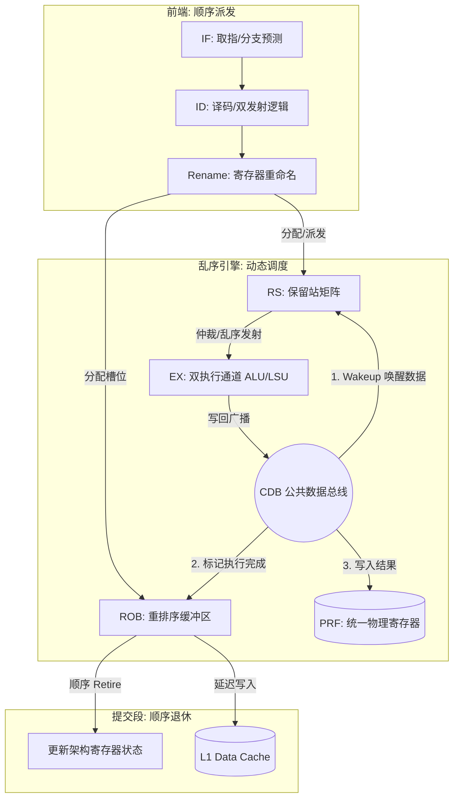

# 从零开始造一颗 RISC-V CPU（五）：乱序执行的来龙去脉与微架构实现

> 系列博客第 5 篇 —— 深入探讨乱序执行（Out-of-Order Execution）的底层硬件机制。本文将从体系结构历史出发，讲解 Tomasulo 算法的演进，并结合完整的微架构全景图（Mermaid 框图）与核心 Verilog 源码，解析我们在 1000 多行代码内构建的这套乱序执行引擎。

---

## 1. 乱序执行的来龙去脉：突破性能的“柏林墙”

在早期顺序执行（In-Order）流水线（如古典的 5 级 MIPS）中，一条流水线遭遇阻塞，整条管线都会停滞。**阻塞的主要元凶是“数据停顿”（Data Hazard）和“长时延操作”（如 Cache Miss、除法器等待）。** 就算后面有毫不相干的独立指令，也会被生生堵在取指/译码阶段——这是一种极大的计算资源浪费。

1967 年，**Robert Tomasulo** 在 IBM System/360 Model 91 浮点运算单元中首次提出了 Tomasulo 算法。这个算法带来了两大极具前瞻性的创新：
1. **保留站（Reservation Station, RS）**：将指令分发到一个缓冲区中等待，数据一就绪即可抛给执行单元脱离顺序，打破了物理执行的先后壁垒。
2. **公共数据总线（Common Data Bus, CDB）**：执行完毕的结果直接广播，还在等待的操作数可以直接通过总线抓取，这也就是今天常说的“旁路（Bypass）网络”的前身。

**引入 ROB 保障精准异常 (Precise Exception)**
原版的 Tomasulo 算法有一个致死缺陷：它是乱序更新体系结构状态的。如果在乱序中途发生了缺页异常或分支预测失败，CPU 无法恢复到异常发生前的精确现场。
直到 1988 年，James Smith 和 Andrew Pleszkun 提出了 **重排序缓冲区（Reorder Buffer, ROB）** 机制。这奠定了现代乱序处理器的黄金定律：**乱序执行，顺序提交（Out-of-Order Execute, In-Order Commit）**。

在我们的 `feature/ooo` 分支中，便完整复现了这一经典的 **Tomasulo + ROB + 统一物理寄存器堆 (Unified PRF)** 的现代微架构设计。

---

## 2. 核心微架构全景图

下图展示了我们 CPU 的核心微架构，这是一条基于双发射的超标量乱序流水线：



指令的整个生命周期可以切分为：**取指 (IF) → 译码/重命名 (Rename/Dispatch) → 监听唤醒与发射 (Wakeup/Issue) → 执行与广播 (Execute & Writeback) → 顺序退休 (Commit)**。

---

## 3. 寄存器重命名（Rename）：解决假依赖的硬件本质

顺序执行中的 WAW（写后写）和 WAR（读后写）冲突被称为“假依赖”，因为它们仅仅是指令在使用同一个显式的寄存器名称，而非真正的数据传递。
现代 CPU（包括 MIPS R10000 风格和我们的实现）利用 **寄存器别名表 (RAT)** 和 **统一物理寄存器堆 (Unified PRF)** 将假依赖剥离。

考虑这段代码的时序：
```assembly
# 架构层级存在严重冲突
add x1, x2, x3     # 指令A：写 x1
sub x4, x1, x5     # 指令B：读 x1 (RAW 真依赖)
add x1, x6, x7     # 指令C：第二次写 x1 (WAW 假依赖)
```

重命名后的状态（硬件动态分配 Free List 中的空闲物理寄存器，如 `p32`, `p33`）：
```assembly
# 物理层级无冲突并行
add p32, p2, p3    # 映射 RAT[x1] = p32
sub p4, p32, p5    # 读 p32
add p33, p6, p7    # 映射 RAT[x1] = p33 (切断了对指令A的影响，完美分离)
```

在同周期内实现**双发射（Dual-Issue）**时，这里涉及非常苛刻的组合逻辑链路。因为 Slot 1 的指令如果依赖 Slot 0 本周期的结果，必须实现同周期的前递（Bypass）：

```verilog
// rename.v: 双发射重命名的同周期接力
wire s1_rs1_eq_s0_rd = s0_alloc && (s0_rd != 0) && (s1_rs1 == s0_rd);

// 槽位 1 寻址时，若检测到命中槽位 0 本周期新分配的目标寄存器，直接取 s0_new_ptag
assign s1_rs1_ptag = s1_rs1_eq_s0_rd ? s0_new_ptag : rat[s1_rs1];
```

---

## 4. 保留站（Reservation Station）与极致的 Wakeup-Select Loop

保留站 (RS) 实质上是一个带有高频比较逻辑的 CAM（内容可寻址存储器）矩阵。操作数尚未就绪的指令会停留在 RS 中，持续“监听”公共数据总线 CDB。

### 4.1 Wakeup（同周期唤醒与数据捕获）
微架构设计中最“烧”时序裕量（Timing Margin）的路径就是 **Wakeup-Select Loop**。当执行单元在周期 N 算出结果打到 CDB 上，周期 N 处于 RS 的指令必须立刻发现：**“我等的数据来了！”** 并立刻将其抓取，保证可以在周期 N+1 进入执行通道。

```verilog
// rs_shadow.v: 基于 CDB 的全相联唤醒逻辑
assign wake_rs1[i] = v[i] && !rs1_rdy[i] &&
    ((cdb0_valid && cdb0_ptag == rs1[i]) ||
     (cdb1_valid && cdb1_ptag == rs1[i]));

// 数据旁路：若当前周期刚被唤醒，直接从 CDB 上拦截数据，而不等其写入 PRF 再读
wire [31:0] rs1_val_bypass = wake_rs1[i] ? 
                             (cdb0_match ? cdb0_value : cdb1_value) : rs1_val[i];
```

### 4.2 Select（基于年龄的最老优先仲裁）
当有多条指令在同一个周期内就绪，谁有资格进入稀缺的单/双执行通道？采用 **Oldest-Ready-First（最老就绪优先）** 能够保证最早进入管线的指令最早释放 ROB 空间。我们利用分配阶段给每条指令打上的 `age`（时间概念），在硬件上通过比较树来实现：

```verilog
always @(*) begin
    issue_v = 1'b0;
    issue_idx = 0;
    issue_age = 32'b0;
    
    for (int i = 0; i < DEPTH; i++) begin
        // 选择条件：表项有效、刚就绪且 age 最大
        if (entry_ready[i] && (!issue_v || age[i] > issue_age)) begin
            issue_v   = 1'b1;
            issue_idx = i;
            issue_age = age[i];
        end
    end
end
```

---

## 5. 重排序缓冲区（ROB）：精准异常的守护者

由于执行单元是乱序交卷的，任何由于访存（LSU）引起的 Page Fault，或是分支预测器（BPU）引发的 Branch Miss，都不能污染已经“乱跑在前面”的代码的体系结构状态。

**ROB 强制将指令进行“顺序排序”**。分配时挂在队尾（Tail），交卷时挂在对应的栏位。但只有在队头（Head）的指令也完成交卷（Done=1）时，才被允许写回架构（Retire）。

```verilog
// rob.v: 双向 (2-wide) 的同周期 Retire 检查逻辑
assign commit_valid_0 = valid_q[head] && done_q[head];
// Slot 1 的提交具有严格的顺序绑定：强依赖 Slot 0 被正常 Commit
assign commit_valid_1 = valid_q[head+1] && done_q[head+1] 
                     && commit_valid_0 && (cnt >= 2);

always @(posedge clk) begin
    if (commit_valid_0) begin
        // 更新精准状态：RRAT 指向新的物理寄存器，释放上一代旧状态的资源
        arch_rat[rd_0] <= ptag_new_0;
        fl_push(ptag_old_0);
        
        // 【关键】对 Data Cache 的 Store 操作必须在 Commit 这个周期才能对外真实发送
        if (is_store_0) dmem_write(saddr_0, sdata_0);
    end
end
```
如果在 Commit 阶段探明了这是一个由于预测失败导致的错误路径，ROB 会直接发出 `Flush` 信号，瞬间将 Speculative RAT 和所有 RS 项清空，使机器完美地恢复到指令发生前的清白之流。这就是为什么在 OoO 架构中，**Store 操作永远是被延迟到管线的最末端才真写内存**的原因。

---

## 6. 微架构性能对比推演

我们将 OoO 核心挂载于标准的 Benchmark 测试套件上以验证其实际杀伤力。测试基于带有指令/数据 Cache 周期的 Verilator 闭环仿真：

| Benchmark (RISC-V 32I) | In-Order (CPI) | OoO (CPI) | IPC 提升评估比 |
|------------------------|---------------:|----------:|--------------:|
| fib_20 (强数据依赖循环)| 1.22           | **0.65**  | **+ 87%**     |
| bsort_16 (短循环跳转多)| 1.07           | **0.84**  | **+ 27%**     |
| memcpy_64w (长线访存)  | 1.02           | 1.01      | ~ 1% 持平     |

**分析总结：**
- **强数据依赖（fib_20）**：在 In-Order 中，由于斐波那契数列寄存器计算的强关联，管线被填满了空泡。在 OoO 架构下，独立循环计算通过 Renaming 被拆解出庞大的指令级并行度（ILP），双发射槽满载运作，性能激增近一倍（CPI < 1 代表 IPC 突破了标量极限率）。
- **线性访存（memcpy）**：OoO 也不是万能药。当代码纯粹是对数据段的流式加载和存储时，不存在因为假依赖导致的过量阻塞，OoO 没有指令排序的操作空间，因此二者表现持平。

我们用仅仅 **1082 行 Verilog** 代码囊括了整个精巧且逻辑高压的 Tomasulo 引擎核心（包含重命名、ROB 序控和基于 CDB 的保留站）。乱序引擎的构建是将学术理论翻译为时序数字逻辑的极限挑战。

下一篇，由于引入了复杂的投机执行，我们将探讨**微架构设计中的验证体系（Verification）** —— 如何通过 Python 开发随机汇编测试框架，确保 CPU 在海量异常分支穿插的刁钻环境下绝不崩溃。

---
*项目地址：[github.com/HaibinLai/simple-CPU](https://github.com/HaibinLai/simple-CPU)*
